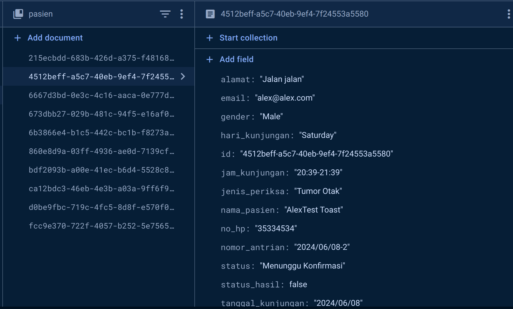

# Repository API to tim mobile

Silakan gunakan API ini untuk tim mobile

## Changes between the first and second version
### api-v1


### api-v2


## Installation

Install mira backend api on local

```bash
  git clone -b api-v2 https://github.com/ENTS-H112/mira-backend.git
  cd mira-backend
  npm i
```

run using Node
```bash
  npm run start
```

run using Nodemon
```bash
  npm run dev
```

## How to use API

Get all endpoint
```bash
  http://localhost:4000
```
Response
```json
{
    "message": "Welcome to the MIRA API",
    "description": "This API is used for managing appointments and patients data",
    "endpoints": {
        "addDoctor": "/doctor",
        "getDoctors": "/doctors",
        "getDoctor": "/doctor/:id",
        "updateDoctor": "/doctor/:id",
        "deleteDoctor": "/doctor/:id",
        "getUser": "/user",
        "updateProfile": "/user",
        "addAppointment": "/add",
        "getPatients": "/patients",
        "getPatient": "/patient/:id",
        "deletePatient": "/patient/:id",
        "updatePatient": "/patient/:id",
        "getHistory": "/patient/:id/history",
        "getNotification": "/user/:id/notification",
        "addResult": "/patient/:id/result",
        "getResult": "/patient/:id/result",
        "uploadFile": "/upload",
        "getFile": "/file/:filename"
    },
    "lastUpdate": "Friday, 8th June 2024, 07:50 PM"
}
```

Login to get token (POST)

```bash
https://identitytoolkit.googleapis.com/v1/accounts:signInWithPassword?key={key}
```
Body
```json
{
    "email": "email@mail.com",
    "password": "pasword",
    "returnSecureToken": true
}
```

### Save idToken and insert it into the authorization Bearer
<b>Note: Bearer Token is only valid for one hour.</b>

POST Create new appointment


```bash
  http://localhost:4000/add
```
```json
{
  "nama_pasien": "Nama",
  "alamat": "Alamat",
  "tanggal_lahir": "1990-01-01",
  "gender": "Male",
  "no_hp": "1234567890",
  "email": "email@example.com",
  "tanggal_kunjungan": "2024-06-03",
  "jam_kunjungan": "11:00"
}
```

GET All patients by user ID
```bash
  http://localhost:4000/patients
```

Response
```json
[
    {
        "nama_pasien": "name",
        "gender": "Male",
        "no_hp": "1234567890",
        "jam_kunjungan": "11:00-12:00",
        "nomor_antrian": "2024/06/03-4",
        "hari_kunjungan": "Monday",
        "alamat": "123 Main St",
        "user_id": "unique ID",
        "id": "Unique Id",
        "tanggal_lahir": "1990-01-01",
        "email": "john@example.com",
        "tanggal_kunjungan": "2024/06/03",
        "status": "Menunggu Konfirmasi"
    },
    {
        "nama_pasien": "name",
        "gender": "Male",
        "no_hp": "1234567890",
        "jam_kunjungan": "10:00-11:00",
        "nomor_antrian": "2024/06/03-3",
        "hari_kunjungan": "Monday",
        "alamat": "123 Main St",
        "user_id": "Unique ID",
        "id": "Unique ID",
        "tanggal_lahir": "1990-01-01",
        "email": "john@example.com",
        "tanggal_kunjungan": "2024/06/03",
        "status": "Menunggu Konfirmasi"
    }
]
```

GET patient by patients ID

```bash
  http://localhost:4000/patient/:id
```
Response
```json
{
    "nama_pasien": "nama",
    "gender": "Male",
    "no_hp": "1234567890",
    "jam_kunjungan": "11:00-12:00",
    "nomor_antrian": "2024/06/03-4",
    "hari_kunjungan": "Monday",
    "alamat": "123 Main St",
    "user_id": "unique id",
    "id": "unique id",
    "tanggal_lahir": "1990-01-01",
    "email": "john@example.com",
    "tanggal_kunjungan": "2024/06/03",
    "status": "Menunggu Konfirmasi"
}
```
## Coming Soon

## Postman Collection

 [Postman Collection](https://planetary-desert-87791.postman.co/workspace/New-Team-Workspace~04bf919a-1924-46ef-a272-1654e0d870ab/collection/24413897-491a24f2-df66-4b40-aba0-a6729b331c06?action=share&creator=24413897)

